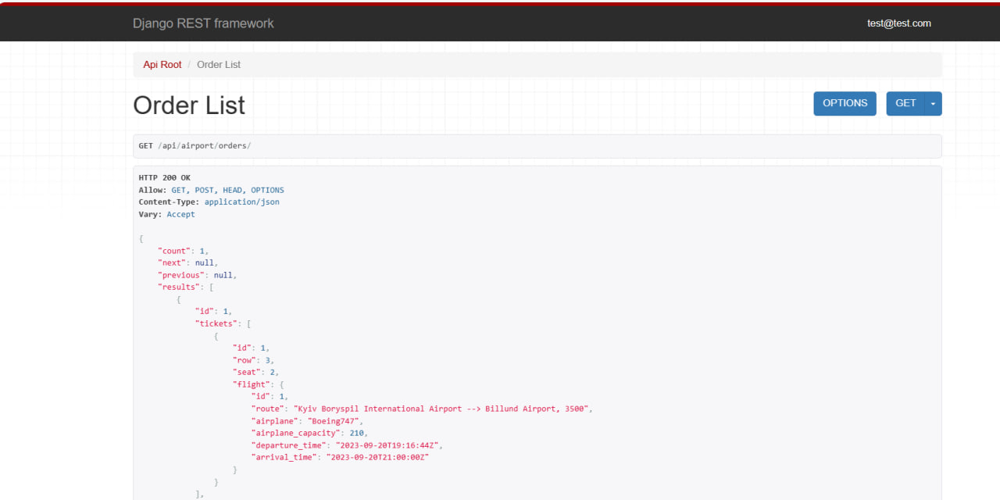

# Airport API Service

Django REST Framework API Project.
Air travel service, which includes the management airports, routes, crews, airplanes, flights and order tickets


## Installation

Python3 must be already installed

```shell
git clone https://github.com/Mykhailo-Benzel/airport-api
python3 -m venv venv
source venv/bin/activate (on macOS)
venv\Scripts\activate (on Windows)
pip install -r requirements.txt

# Set up environmental variables for Postgres and your secret key
export POSTGRES_HOST=<your db hostname>
export POSTGRES_DB=<your db name>
export POSTGRES_USER=<your db username>
export POSTGRES_PASSWORD=<your db user password>
export SECRET_KEY=<your secret key>

python manage.py runserver # Starts Django Server
```

## Features
* User Management: Provide user authentication and authorization for the API endpoints.
* Crew Management: Add and edit information about flight crews.
* Airplane Management: Add and edit information about airplane, its name, type, and number of seats.
* Route and Airport Management: Add and edit information about the route, place of departure and destination.
* Flight Management: Add and edit flight schedules, specifying departure dates and routes.
* Ticket Management: Passengers can browse available flights, select routes, and purchase tickets.
* Order Management: Passengers can view their orders and tickets.
* API Documentation: Provide detailed documentation of the API endpoints with Swagger.

## Demo



